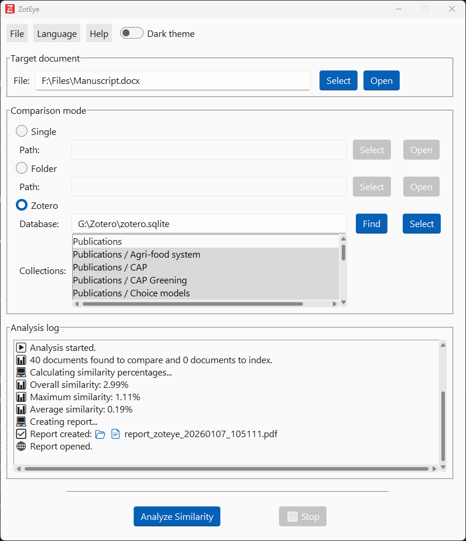
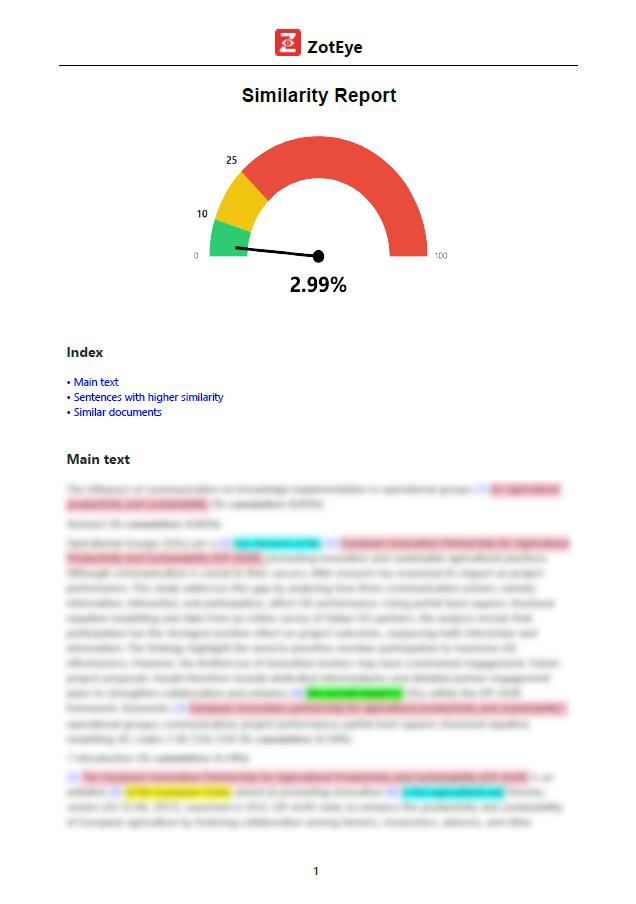
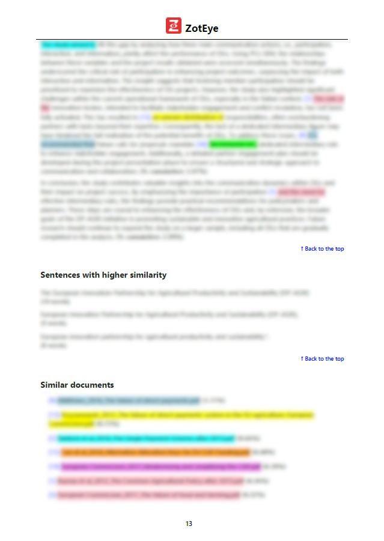

<a id="readme-top"></a>

<div align="center">
  <a href="https://github.com/abonfiglio73/zoteye">
    
  </a>

<h1 align="center">ZotEye</h1>

  <p align="center">
    Plagiarism detection for <a href="https://www.zotero.org/">Zotero</a> reference libraries
    <br />
    <a href="https://github.com/abonfiglio73/zoteye/issues/new?labels=bug&template=bug-report---.md">Report Bug</a>
    &middot;
    <a href="https://github.com/abonfiglio73/zoteye/issues/new?labels=enhancement&template=feature-request---.md">Request Feature</a>
  </p>
</div>

<div align="center">

[](https://www.python.org/downloads/)
[](https://github.com/abonfiglio73/zoteye/releases/latest)
[](LICENSE)
<!-- For private repository -->
<!-- [](https://github.com/account/repo/releases) -->
<!-- For public repository -->
<!-- [](https://github.com/account/repo/releases/latest) -->
</div>

<details open>
  <summary>Table of Contents</summary>
  <ul>
    <li>
      <a href="#about-the-project">About The Project</a>
    </li>
    <li>
      <a href="#main-features">Main Features</a>
    </li>
    <li>
      <a href="#getting-started">Getting Started</a>
      <ul>
        <li><a href="#project-structure">Project Structure</a></li>
        <li><a href="#prerequisites">Prerequisites</a></li>
        <li><a href="#installation">Installation</a></li>
        <li><a href="#execution">Execution</a></li>
        <li><a href="#distribution">Distribution</a></li>
      </ul>
    </li>
    <li><a href="#usage">Usage</a></li>
    <li><a href="#roadmap">Roadmap</a></li>
    <li><a href="#contributing">Contributing</a></li>
    <li><a href="#license">License</a></li>
    <li><a href="#author">Author</a></li>
  </ul>
</details>


## About The Project

**ZotEye** compares a document with the documents in the local [Zotero](https://www.zotero.org/) reference library, automatically identifying similar text and overlaps. It helps authors avoid article rejections due to potential plagiarism and assists editors in verifying the originality of submitted manuscripts. The ultimate goal is to enhance transparency and reliability in scientific research.

> [!NOTE]
> All similarity analyses are performed locally. No texts, articles, plagiarism results, or reports are uploaded online.

[](https://github.com/abonfiglio73/zoteye)

<p align="right">(<a href="#readme-top">back to top</a>)</p>

### Built With

[](https://www.python.org/)


## Main Features

* 🚀 Graphical interface
* 🌎 Multilingual (EN, IT)
* 📚 PDF text extraction
* 🔍 Automatic similarity analysis between a document and the local Zotero reference library
* 🔪 Possibility of excluding sections (e.g., "references") and quoted sentences from analysis
* 🧠 NLP based on n‑gram (words)
* 🔢 Calculation of similarity percentages and per document
* 🧾 Similarity report
* 💾 Local cache to speed up subsequent analyses
* 📅 Automatic updates


<p align="right">(<a href="#readme-top">back to top</a>)</p>

## Getting Started

### Project Structure

The repository structure can be found here:
[`tree.md`](tree.md)

<p align="right">(<a href="#readme-top">back to top</a>)</p>

### Prerequisites

* Windows 11 (_should also work on Windows 10_)
* [Python 3.11–3.14](https://www.python.org/downloads/) (_Python 3.14.2-amd64 was used to build this app; higher versions were not tested_)
* Required Python libraries (see [requirements.txt](/requirements.txt))
* [NSIS installer](https://sourceforge.net/projects/nsis/files/) (_version 3.11 with [INetC plug-in](https://nsis.sourceforge.io/Inetc_plug-in) was used for distributing this app when building from source code_)

<p align="right">(<a href="#readme-top">back to top</a>)</p>

### Installation

#### Latest Release

If you are only interested in the executable, go to [releases](https://github.com/abonfiglio73/zoteye/releases), download, and install the latest version (`ZotEye_Installer.exe`).<br />
In this case, if Python 3.11-3.14 is not found on the system, Python 3.14.2 (64-bit) and the necessary libraries will be downloaded and installed by the installer.<br />
> [!WARNING]
> ZotEye is a free, open-source application. However, some browsers or security systems may show warnings when downloading or opening `ZotEye_Installer.exe`: 
> * In MS Edge, you might see: "_ZotEye_Installer.exe is not commonly downloaded. Make sure it is safe before opening it._" Click the three dots in the top-right corner and select Keep, then click the three dots in the bottom-right corner of the next window and select Keep Anyway.
> * Tools such as Microsoft Defender SmartScreen may also block the installer. Right-click the file, choose Properties, click Unblock, and then OK. Once unblocked, the installer can be run normally.   

#### Source Code

If you want to view and work on the source code:

1. Download and install Python 3.11-3.14 from https://www.python.org/downloads/ (_if not already present; during installation, select the option "Add python.exe to PATH" for quick access to Python commands in the command prompt or PowerShell_.)
2. Clone the repository
   ```sh
   git clone https://github.com/abonfiglio73/zoteye.git
   ```
3. Create a Python virtual environment inside the `zoteye` folder
   ```sh
   cd zoteye
   python -m venv venv
   ```
4. Activate the virtual environment 
   ```sh
   .\venv\Scripts\activate
   ```
5. Install dependencies
   ```sh
   pip install -r requirements.txt
   ```
<p align="right">(<a href="#readme-top">back to top</a>)</p>

### Execution

#### Latest Release

After <a href="#installation">installation</a>, open the app **ZotEye**.

#### Source Code

To run the application from the source code, use:
   ```sh
   python .\main.py
   ```

<p align="right">(<a href="#readme-top">back to top</a>)</p>

### Distribution

To distribute the application from the source code as an executable (.exe), run the following script:
```sh
.\install\build_installer.bat
```
Make sure that [NSIS](https://sourceforge.net/projects/nsis/files/) is installed and that NSIS path inside the script `build_installer.bat` is correct:
```sh
NSIS_PATH=C:\Program Files (x86)\NSIS\makensis.exe
```
The script will create the installer file `ZotEye_Installer.exe` inside the `build` folder.

<p align="right">(<a href="#readme-top">back to top</a>)</p>

## Usage

### Comparison Modes
Three comparison modes are available:

1. target document → single document
2. target document → documents in a folder
3. target document → local Zotero reference library

The comparison is based on **n‑gram** (word) matching.<br />
The target document can be PDF or DOCX; if DOCX, it will be converted to PDF.<br />
Documents to compare must be PDFs.<br />
In the third mode you need to specify the path to the Zotero database (`zotero.sqlite`). The path can be found manually or via an automatic search.<br />
Once specified, the **collections** present in the reference library will be shown. The user may choose one or more collections.

> [!NOTE]
> **Choosing the n-gram size**
>
> ZotEye uses 4-word n-grams by default for text similarity in scientific papers. Different sizes can be chosen:
> * **Small (1–2 words)**: detects short overlaps, may give false positives.
> * **Medium (3–5 words)**: good balance, recommended for general use.
> * **Large (6+ words)**: finds exact matches, best for detecting significant reuse.
>
> Start with the default 4-word n-grams; adjust if you want more sensitivity (smaller) or specificity (larger).


### Local cache
To speed up subsequent analyses, ZotEye **saves n‑grams locally** in a database by default. The saved n‑grams depend on the selected options (n‑gram size, excluded sections and quoted sentences). Users can modify this behavior.<br />
Database management can be done in two ways:
* **_Incremental_** (default): All databases with n‑grams saved using the active options are loaded. Only n‑grams from new documents that are not already in the databases are stored.
* **_Non‑incremental_**: A single database (if it exists) is loaded with the same set of options and contains the n‑grams for the same documents. N‑grams from documents already present in other databases may still be saved if they belong to a group of documents not yet indexed.

> [!TIP]
> A non‑incremental approach is useful when you want to limit similarity analysis to specific folders or collections.

### Report
The generated report (PDF version):

- 📑 Highlights the n-grams found in the compared documents
- 🖌️ Uses different colors to distinguish documents
- 🔗 Includes a link to the document (and page) within the text
- 🔢 Shows overall similarity percentage and cumulative similarity percentages per paragraph
- ✍️ Lists sentences with higher similarity sorted by number of n-grams
- 🔖 Lists documents sorted by similarity percentage

  <a href="assets/images/screenshot2.png">
    
  </a>
  <a href="assets/images/screenshot3.png">
    
  </a>

> [!IMPORTANT]
> | **Overall Similarity Percentage** | **Interpretation** |
> |:---|:---|
> | **<10%** | Generally acceptable |
> | **10–25%** | Requires review, especially if concentrated in a few sections and/or longer sentences |
> | **>25–30%** | Almost always considered problematic |


<p align="right">(<a href="#readme-top">back to top</a>)</p>

<!-- ROADMAP -->
## Roadmap
Possible future developments:

- 🎯 Compatibility with other operating systems (e.g., Linux)
- 🎯 Graphical highlighting of similar sentences in the original DOCX
- 🎯 Similarity calculation via:
    - Embeddings with local LLM models
    - Cosine similarity

<p align="right">(<a href="#readme-top">back to top</a>)</p>

## Contributing

If you have a suggestion improving this app, you can:

1. Fork the Project
2. Create your Feature Branch (`git checkout -b feat/myfeature`)
3. Commit your Changes (`git commit -m "Add myfeature"`)
4. Push to the Branch (`git push origin feat/myfeature`)
5. Open a [Pull Request](https://github.com/abonfiglio73/zoteye/pulls)

Alternatively, you can simply request a [feature](https://github.com/abonfiglio73/zoteye/issues/new?labels=enhancement&template=feature-request---.md) or report a [bug](https://github.com/abonfiglio73/zoteye/issues/new?labels=bug&template=bug-report---.md).

<p align="right">(<a href="#readme-top">back to top</a>)</p>

## License

Distributed under the [MIT license](https://github.com/abonfiglio73/zoteye?tab=MIT-1-ov-file).

<p align="right">(<a href="#readme-top">back to top</a>)</p>

## Author

Andrea Bonfiglio, &copy; Copyright 2026

<p align="right">(<a href="#readme-top">back to top</a>)</p>